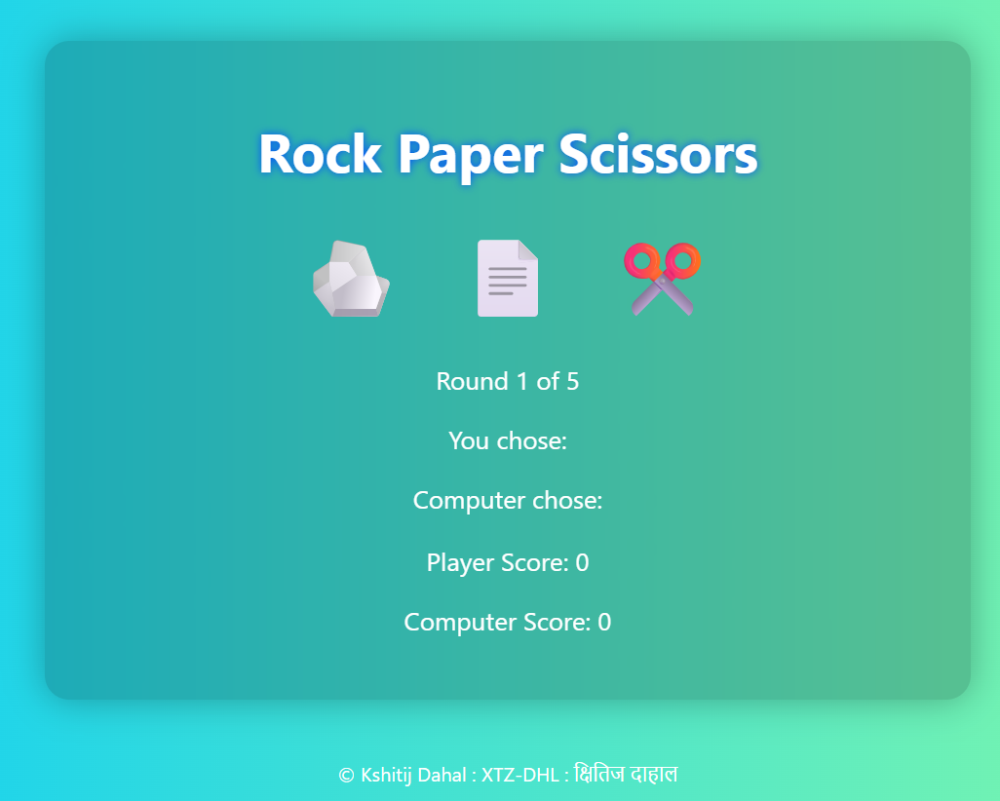

# Rock Paper Scissors Game ✂️🪨📄

A simple and fun Rock Paper Scissors game built with HTML, CSS, and JavaScript.  
Uses emojis instead of images, features sound effects, a 5-round match system, score tracking, and a replay option.

---

## Features

- Play Rock, Paper, or Scissors using emoji buttons  
- Best of 5 rounds match system  
- Real-time score tracking for player and computer  
- Sound effects for each round’s outcome (win/lose/draw)  
- Play Again button to restart the game  
- Clean, colorful UI without gray backgrounds  

---

## Demo

---

How to Play
Click one of the emoji buttons (✂️ Rock, 🪨 Paper, 📄 Scissors) to make your choice.

The computer randomly selects its choice.

The winner of the round is shown with updated scores.

Play 5 rounds to complete the match.

Use the Play Again button to reset and start a new match.

Technologies Used
HTML5

CSS3

Vanilla JavaScript
